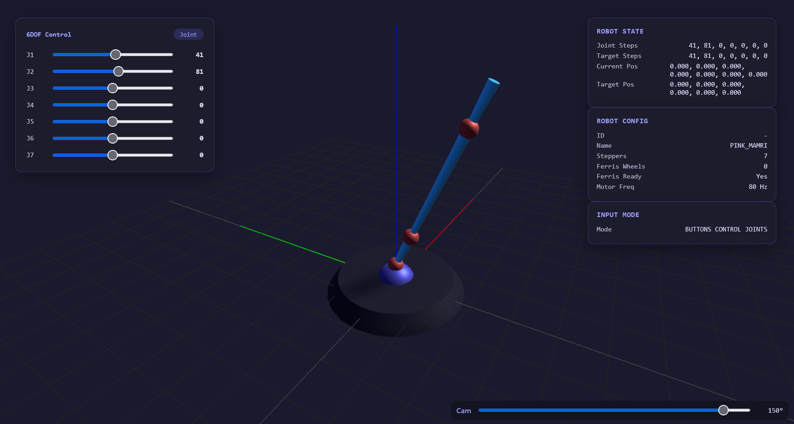

If building ros is failing, run the following commands:

```bash
rm -rf .microros                       
rm -rf .pio
```

Sometimes we need to clean the enviorment if a build failed before. Also, we need to stay in (.venv). This is important, it only works here. 

```bash
source /Users/jansampolramirez/Desktop/Escritorio2/JAN/Master/Thesis/mamri_ws/mamri/Arduino_scripts/Mamri_v6_PlatformIO/.venv/bin/activate
```

```bash
~/.platformio/penv/bin/pio run
~/.platformio/penv/bin/pio run --target upload
~/.platformio/penv/bin/pio device monitor
```

```bash
~/.platformio/penv/bin/pio run -t clean  
~/.platformio/penv/bin/pio run -e inputcontroller-test -t upload
~/.platformio/penv/bin/pio device monitor
```

# GRACE MAMRI CONTROLLER 
#### For ESP32-C5 Devkit with Expansion board
By: Julian van der Sluis - Jan 2026

## Overview
This MAMRI controller code is made for the ESP32-C5 devkit. This microcontroller is chosen for its 5Ghz Wifi capabilities, which is needed when working in an environment with a lot of wifi hosts. The ESP replaces the Raspberry Pico 2. (This has a wifi variant, the pico 2w, but only does 2.4Ghz wifi).
This expansion allows for more I2C devices, SPI devices, has a 5Ghz wifi webserver, and allows for future expansion with different input methods. Like touchscreens, a spacemouse or whatever you manage to connect.

The code is structured in folders, classes and makes use of .h and .cpp files. Please keep this order as this allows for easy debugging and faster compile times. The header files (.h) are a list of function names of that class, which is helpfull when learning what each class can do. These functions are implemented in the .cpp file.

## Usage
Connect a robot or induvidual stepper to the valve output at the back of the controller. Make sure to start on the left with motor 1.
Open the webpage by typing in the IP address in a webbrowser. (Not working? Find IP by looking at the Serial Monitor)
Select the relvant Robot Config with the **Switch Robot** button. Look at the web page to see which mode you are in. 
Using the Input Mode Selection you can set either joint control or positional control (latter is not working, needs IK integration)
- Joint Control, allows each induvidual joint to be controlled using the horizontal button pairs.
- Positional Control, this maps the first 6 pairs of buttons to translation and rotation of the target setpoint.

Some robot require **Ferris Wheels** to be connected. (These are the magnetic encoders with ropes). Connect the Ferris Wheels correctly. 
[Red = 3.3v, Black = GND, Yellow = SCL, Orange = SDA]. Work from left to right and then backwards. Details in I2C Manager section.

Joint positions can be controlled through the webpage aswell. Always keep an eye out for the real robot, when something goes wrong hit the **Emergency Button** on the top, this cuts out the air pressure and stops the main loop.
(Motor service and webserver keep working, as these are called in the background)

Continue reading to understand the code better, and to change it. 

## Robot Controller
Valve control, forward- and inverse kinematics are handled by the **RobotController**.
These classes communicate with each other via the RobotState, containing current position, last position and target position (setpoint).

### Robot Configurations
This code allows for live switching of robots, by changing the robotConfig. This is one of the RobotStructs, containing the name, number of steppers, number of ferriswheels, degrees of freedom (DOF) and other settings of each robot type. When adding functionality try to rely on the state of the robotConfig, and make sure it is updated when a robot is changed. The idea is to have a robotConfig which stays the same, to ensure that the robot is connected properly. During the testing of a robot the stepper, or stepper and ferriswheel configs can be used, and during runtime the number of steppers can be selected.
These are the current robot configs: 
- Purple Mamri 
- Pink Mamri (385) 
- Stepper Tester 
- Stepper And FerrisWheel Tester 
- No Robot

### Changing Configurations
Go to the RobotController.cpp file in /src/RobotController/ and look for the setupPinkMamri() function. ~line 150. Below this function the other robot setups are defined too. Here you can change values so they correspond to the robot. For each stepper you want to control add a DOF and Stepper. Also do this for the number of Ferris Wheel you want to connect.

### Adding Robots
To add Robots you have to make sure a Robot Name exists for this robot. For this we use an enum, a number with a human readable name. (PURPLE_MAMRI = 1)
- Go to Robot Structs and add a unique and descriptive name to your Robot. Increment the Id this name represents. 
- Go to RobotController.cpp
- Copy one of the setup functions which most represents your robot (~ line 150)
- Change the values, and configure wether you need a kinematics object or not. (Create a setup function for kinematic too, and initiate kinematics object if you require this, otherwise leave it)
- Go the function nextRobot in RobotController.cpp and your Robot in the case statement, maintain cyclical order.
- In the Webserver.cpp class, in the endpoint for /robotconfig. add a conversion for you speficic robot, this is its display name on the server, otherwise the webpage does not get a correct value.

### SPI1

One SPI device, the MCP23S17 chip, a 16 pin GPIO pin expander is connected. It can switch several transistors to turn on the correct valves. (No Chip select is needed as there is only one device, for consitency the same structure and libraries are used.)

## Input Controller
This controller manages the inputs to the system in the **InputController**, such as positional feedback or user input.

### Webserver
A **webserver** is also started by the ESP, this is a child of the InputController. When you enter the IP address, the ESP serves files and data to the client. (you)
The selected robot config and the robotstate, containing its position is send to the client. Through a web page the client can send commands to move the joints of the robot.
**LittleFS** is used to upload files to a small filesystem. These are contained in /data. To serve other files on the webserver, add the corresponing GET endpoint, similar to /index.html


## Hardware Interface
The InputController is in charge of reading and writing to hardware relating to user input. It defines the behavior of the controller and updates the robotControllers positions and setpoints. 
The **SPI0** bus and **I2C** bus are both controlled by their own class, which allows for abstraction of communication. Simple functions can be called to get specific readings for each of the components. This splits the reading form the behavior code. The motor valves are connected to **SPI1**.

### SPI0 & Chipselect

The **SPI0** bus has several devices, which requires a ChipSelect pin (CS). However, as the ESP has fewer pins, and the need for more SPI devices might be required in the future. It was decided to make use of a demultiplexer. The CD4515 chip takes 4 bits as input and set a pin from 0-15 low. (Active low, so the rest stays high). The first 6 CS pins are wired to the CS pins on the MAMRI controller board, but 7-15 are free and can be used for other external SPI devices. (more MCP23S17 gpio expander chips or SPI sensors)
For the UI of the MAMRI controller several MCP23S17 chips are used, the same as the motorvalves. The library of this component has been altered to allow for our CS handling. The SPI managers make sure to select each device mannually before calling the MCP chips. A toggle of the CS pin is required for the chips to start listening, this is why first NO_DEVICE is selected. (Pin 0 of the demultiplexer is not connected)

### I2C

The I2C bus is connected to 3 TCA chips. These are I2C multiplexers. One of these is 'internal', meaning that it is part of the PCB of the MAMRI. It is connected to two pressure sensors.
The other TCA chips (can be expanded easily) are mounted on the expander board. These allow for 8 I2C devices / multiplexer. It was chosen to have 12 reserved for FerrisWheel sensors, and the remaining 4 can be used for other I2C devices.
It is possible to expand the I2C bus, make sure to set the address of each tca chip to the next binary number. (0x70, 0x71, 0x72 etc.)

## Hardware

The pcb of the MAMRI controller was made for the PICO2 so the wiring from the esp to the pico had to be redone. Below you can see the remapping.


The cd4515 is a demultiplexer and is connected to 4 GPIO pins of the ESP, pin 0 is not connected, pins 1-6 are connected to the mamri CS pins, further cs pins can be used for external spi devices.

## Future Expansion
For integration into a medical setting, the Mamri Robots need to be more user friendly. The Grace Mamri controller allows future researchers to develop and integrate new input methods to control the Robot. Hopefully increasing usability, and reducing the cognitive load to precisely position the robot. Also aim to keep the project understandable for new students, from bachelors to phd ;D


Parts to focus on:
- Getting IK working for both Pink and Purple Mamri
    The kinematics of the Pink Mamri are already in the Kinematics Controller. It has to be called from the update loop in RobotController. Placeholder comments show how this can be done.

- Integration with spacemouse
    Similar to the Control over Serial, implemented in the Mamri_v5 Controller, a spacemouse can be connected to this controller too. Have the InputController update the target position of the RobotController.
    My design for this type of control in the workflow is to have the webpage show a transparent position&rotation point/arrow. Then moving the spacemouse updates only the target position. Then a final confirm by the user actually actuates the motors, preventing accidental movements. For this a webserver is required to show this target point in 3D space.
    Possibly by adding a FeatherWing USB host, over SPI.

- Improving Visual rendering of the robot.
    Preferably a Forward and Inverse rendering option for the robot is implemented, which makes use of the kinematicsController class. Where is shares the robotkinematics through an endpoint to the webclient.
    Then we can make sure the rendering is accurate to the real world.

- Getting TFT Screen working over SPI.
    Possibly by using a real, but unused GPIO pin to act as a SPI Chip Select Pin. Then still manually wrapping the CS select in SPI0Manager.
    Display IP, Selected Robot, Motor Freq. Basically Everything that is displayed on the webserver.

- Port more functionality of the Mamri_v5 Controller.
    Use a button to cylce through menu options (similar to Robot Selection)
